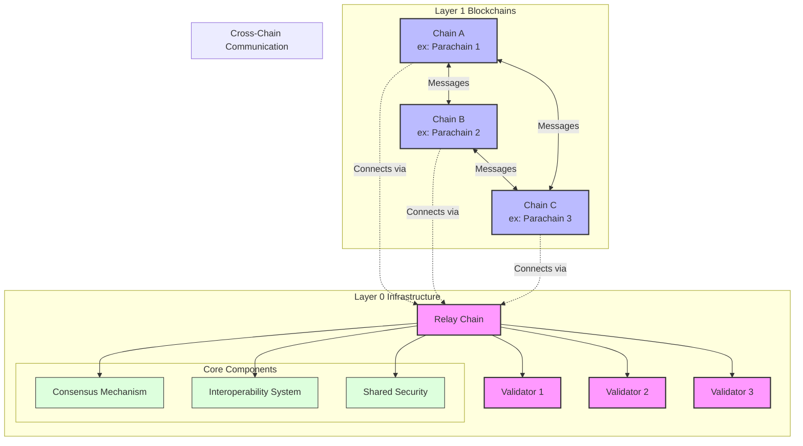

# Understanding Layer 0 in Blockchain

## What is Layer 0?

Layer 0 represents the foundational infrastructure of blockchain networks, serving as the base layer upon which Layer 1 blockchains (like Bitcoin, Ethereum) are built. It manages cross-chain communication, consensus mechanisms, and network interoperability.

## Architecture

## How Does Layer 0 Work?

Layer 0 operates through several key mechanisms:

1. **Consensus Mechanism**

   - Validates transactions across multiple chains
   - Ensures network security and agreement
   - Coordinates between different blockchain networks

2. **Interoperability Protocol**

   - Enables cross-chain communication
   - Manages asset transfers between chains
   - Handles message passing between different blockchains

3. **Security Framework**
   - Provides shared security for connected chains
   - Validates network participants
   - Manages network validators

## Why Do We Need Layer 0?

Layer 0 solves several critical blockchain challenges:

1. **Scalability**

   - Enables parallel processing across multiple chains
   - Reduces network congestion
   - Increases overall transaction throughput

2. **Interoperability**

   - Facilitates seamless communication between different blockchains
   - Enables cross-chain asset transfers
   - Supports cross-chain smart contract interactions

3. **Customization**
   - Allows blockchains to maintain independence while sharing infrastructure
   - Enables specialized chains for specific use cases
   - Supports different consensus mechanisms on different chains

## Popular Layer 0 Solutions

1. **Polkadot**

   - Uses Relay Chain for coordination
   - Supports multiple parachains
   - Provides shared security

2. **Cosmos**

   - Hub-and-spoke model
   - Uses Tendermint consensus
   - Connects independent zones

3. **Avalanche**

   - Subnet architecture
   - Supports custom virtual machines
   - Flexible consensus mechanisms

4. **Near Protocol**

   - Nightshade sharding
   - Cross-chain interoperability
   - Developer-friendly environment

5. **LayerZero**
   - Omnichain interoperability
   - Universal messaging layer
   - Cross-chain smart contract support

## APIs and Development

Layer 0 protocols typically provide several types of APIs:

1. **Core APIs**

   - Network interaction
   - Transaction management
   - State queries

2. **Cross-Chain APIs**

   - Message passing
   - Asset transfers
   - State verification

3. **Development SDKs**
   - Smart contract development
   - Application integration
   - Network monitoring

## Important Note on Layer 1 Independence

Not every blockchain requires a Layer 0 solution. Layer 1 blockchains like Ethereum operate independently but can still interact with Layer 0 protocols through:

- Bridge contracts
- Cross-chain messaging protocols
- Interoperability networks

## Conclusion

Layer 0 represents a crucial evolution in blockchain architecture, enabling better scalability and interoperability while maintaining security. While not essential for all blockchains, it provides valuable infrastructure for the growing blockchain ecosystem.
